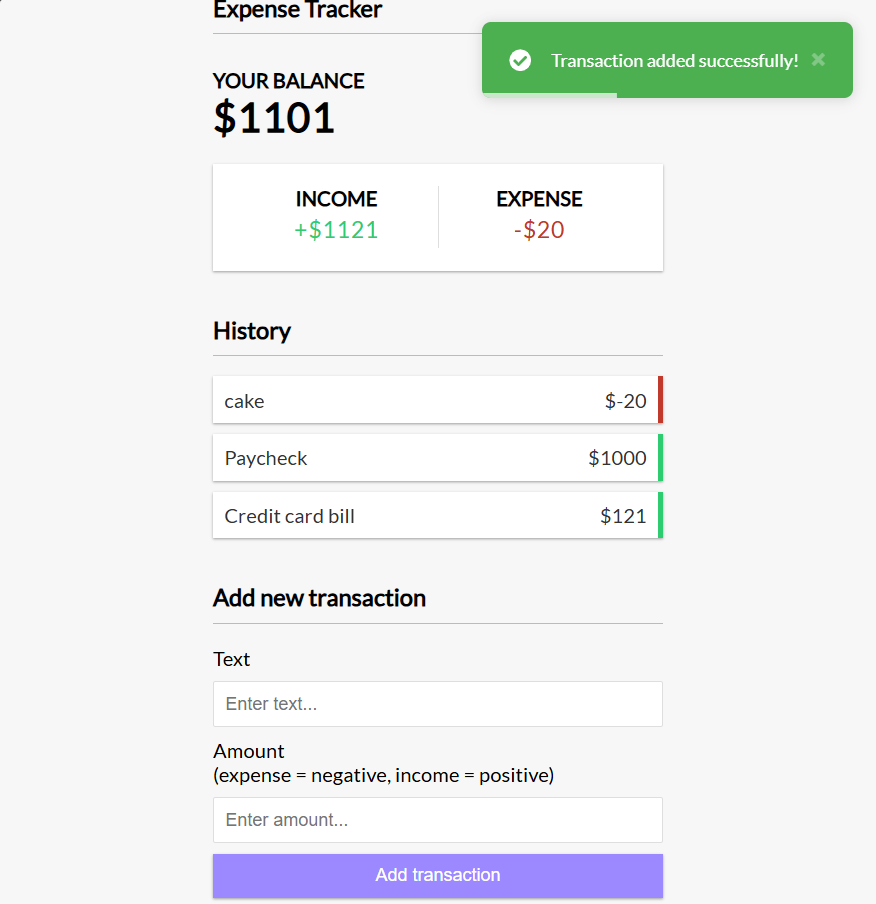

# Simple Expense Tracker

A simple expense tracker built as a single-page application (SPA) using Vue 3 with the Composition API. This application allows users to add and delete expenses/income and view the total expenditure. Data persistence is handled using localStorage, and Vue Toastification is used for validation notifications.

## Features

- **Add Expense/Income**: Users can add new expenses or income entries.
- **Delete Expense/Income**: Users can remove existing expenses or income entries.
- **Total Expenditure**: Users can view the total expenditure calculated from the added entries.
- **Data Persistence**: All data is stored in the browser's localStorage, ensuring data is retained across sessions.
- **Validation Notifications**: Vue Toastification is used to provide feedback to users when validation errors occur.

  

## Project Setup

### Prerequisites

Make sure you have the following installed on your system:

- Node.js (v14.x or higher)
- npm (v6.x or higher) or yarn (v1.x or higher)

### Installation

1. Clone the repository:

   ```bash
   git clone https://github.com/Roger9876/simple-expense-tracker.git
   cd simple-expense-tracker
   ```

2. Install dependencies:

   ```bash
   npm install
   ```

3. Compiles and hot-reloads for development

    ```bash
    npm run serve
    ```

## Usage

1. Open the application in your browser (typically at `http://localhost:8080`).
2. Use the form to add new expense/income entries.
3. View and manage your entries in the list.
4. Observe the total expenditure update automatically as you add or delete entries.

## Libraries and Tools

- **Vue 3**: The Progressive JavaScript Framework.
- **Composition API**: A set of additive, function-based APIs that allow flexible composition of component logic.
- **Vue Toastification**: A Vue.js notification library used for validation notifications.
- **localStorage**: Web Storage API used for data persistence.

## Contact

For any queries, issues, or suggestions, please contact:

- Name: Raviraj Khopade
- Email: <rmkhopade21@gmail.com>

Happy Tracking!
